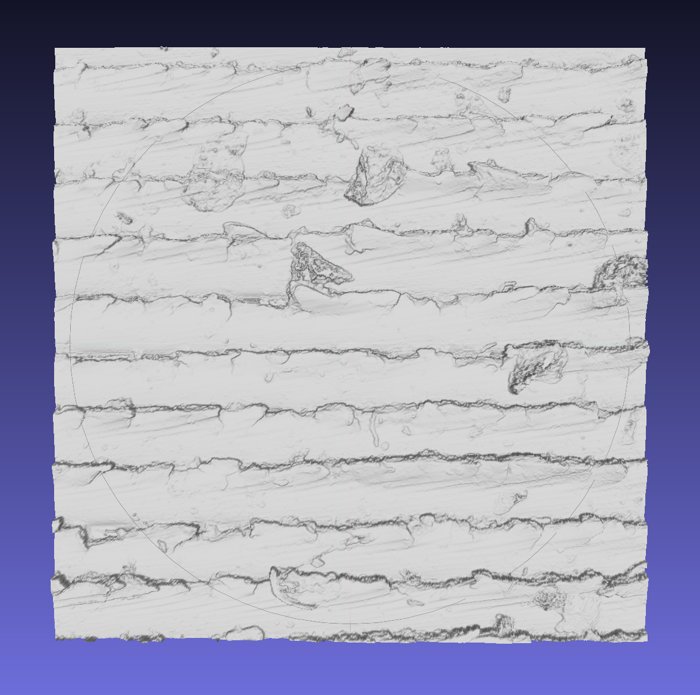
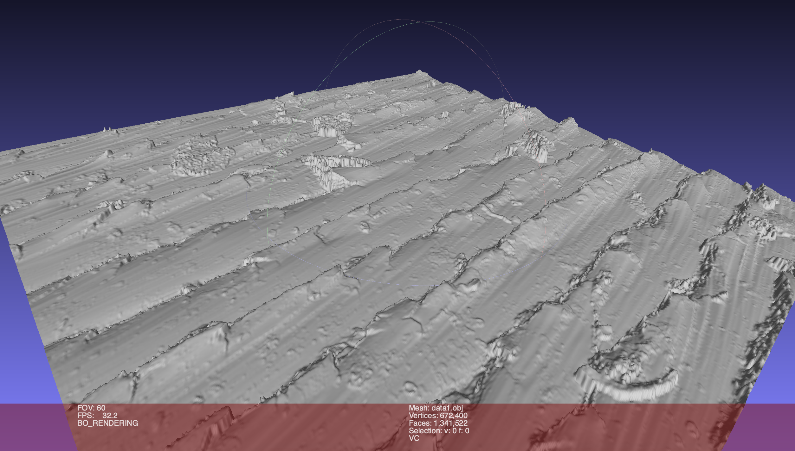

# Microscopy Data
Python code for processing micro surface geometry data


## How to get GSF files

More gsf data files can be downloaded from

https://sid.erda.dk/wsgi-bin/ls.py?share_id=aHNMekcpg5


## How to convert GSF files into mat files

The python script gsf2mat converts a specified gsf.file to a mat-file. Like this

```bash
python gsf2mat.py -i data/data1.gsf -o data/data1.mat
```

This python script only uses numpy. 

## How to convert mat files into obj files

Before doing this you may want to verify that your environment is setup correctly.

Open up your bash profile like this

```bash
CN14804:~ nlp442$ emacs -nw .profile
```


Make sure you have something like this somehwere

```bash
export PATH="$PATH:/Applications/MATLAB_R2018b.app/bin/"
```

This will allow you to use matlab from the terminal command line.

Now in a terminal/command line use this


```bash
matlab -nodisplay -nosplash -nodesktop -r "mat2obj( 0.2, 'data/data1.mat', 'data/data1.obj');exit();"
```

This matlab tool uses the gptoolbox for writing mesh files. One can clone this git project from here

https://github.com/alecjacobson/gptoolbox

Observe that the matlab script mat2obj contains a file path string pointing to the location where gptoolbox is located. This you may have to update to reflect the location where you have chosen to clone gptoolbox.


## How to view obj (mesh) files

Mesh files can be inspected using any kind of software tool. For instance MeshLab can be quite convient for this.

http://www.meshlab.net/

Using MeshLab one will see the surface mesh files like so




# Other Legacy Dependencies and Notes

## OpenMesh
The open mesh library is used in the python script to write mesh files. 

One can obtain the python version of OpenMesh from this url

https://www.graphics.rwth-aachen.de:9000/OpenMesh/openmesh-python

Once the code has been cloned then CD into the repo dir and run this command

````bash
sudo pip install -e .
````

This will build and install OpenMesh on your system.


## pyHull

This is used to get convex hulls of point sets (it is a python wrapper of qhull). It can be installed with pip.


## Libigl


https://github.com/libigl/libigl

## Setting proper versionn of Python

Remember to set python37 (or newer) to be the python interpreter. Using macport this is one like this:

``` bash
sudo port select --set python python37
sudo port select --set python3 python37
```

## Running xcode traget from commandline as root user

How to run an cmake generated install target in xcode as root user

````bash
sudo xcodebuild -target install
````
